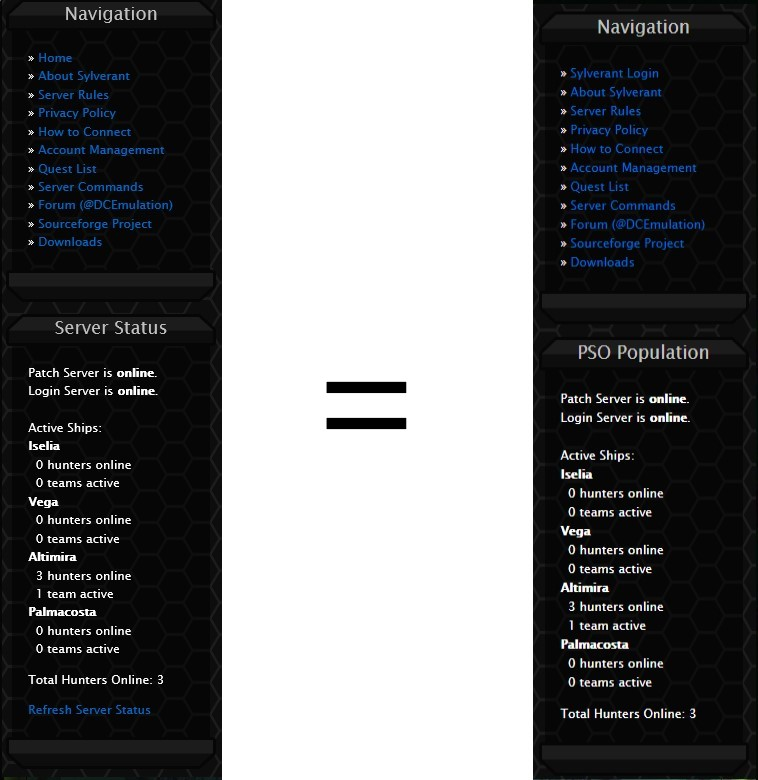

# PSO Sylverant: Realtime Player Population
A simple modification to the Sylverant website enabling users to view the server population in realtime.

### How to Install It:
1. Click on the green 'Clone or Download' button and click 'Download Zip'.
2. Go to your downloads folder and find a file called 'sylverant-realtime-master.zip'.
3. Drag that zip file to your desktop and extract it (Using winrar or 7zip for example).
4. Once extracted, open it up and drag the folder inside of it to your desktop (Anywhere you want to save it really).
5. Open Google Chrome, and in the search bar enter: 'chrome://extensions/'.
6. In the upper left corner, click on 'load unpacked'.
7. Locate the place where you saved the extracted folder and select it.
8. You're done, congrats!

You will know if everything is working properly when you see 'PSO Population' in place of the usual 'Server Status' text on
- the Sylverant website.