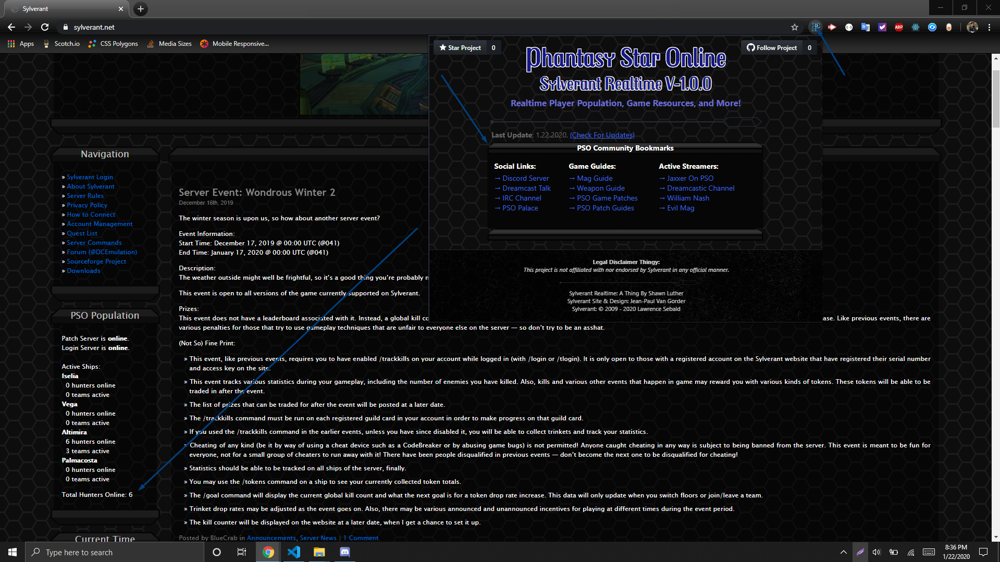

# sylverant-realtime

## Introduction
Sylverant Realtime is a web extension for the Phantasy Star Online Dreamcast private server.
The Sylverant Realtime Extension provides quality of life updates to the servers website.
This includes removing the current 'refresh' button that you need to click to refresh the
servers player population. We made this process realtime, so you will always see
the most current count without having to do any manual actions. We also
provide a list of all the best guides, streamers, and available game 
patches that currently exist. Sylverant Realtime keeps you connected
to all things PSO and Sylverant!

### How to Install It (Google Chrome):
1. Click on the green 'Clone or Download' button and click 'Download Zip'.
2. Go to your downloads folder and find a file called 'sylverant-realtime-master.zip'.
3. Drag that zip file to your desktop and extract it (Using winrar or 7zip for example).
4. Once extracted, open it up and drag the folder inside of it to your desktop (Anywhere you want to save it really).
5. Open Google Chrome, and in the search bar enter: 'chrome://extensions/'.
6. In the upper left corner, click on 'load unpacked'.
7. Locate the place where you saved the extracted folder and select it.
8. You're done, congrats!

### How to Install It (Firefox):
1. Click on the green 'Clone or Download' button and click 'Download Zip'.
2. Go to your downloads folder and find a file called 'sylverant-realtime-master.zip'.
3. Drag that zip file to your desktop and extract it (Using winrar or 7zip for example).
4. Once extracted, open it up and drag the folder inside of it to your desktop (Anywhere you want to save it really).
5. Open Firefox and in the search bar enter: 'about:addons'.
6. Under the 'Find more add-ons' search box, click on the gear (⚙️) icon and select 'Debug Add-Ons'.
7. Next to 'Temporary Extensions', click on the 'Load Temporary Add-On' button.
8. Locate the place where you saved the extracted folder and open it.
9. Finally, click on the 'portal' HTML file.
10. You're done, congrats!

If you followed the above steps correctly, you should see "PSO Population" where "Server Status" once was on the website.

### Most Supported Browsers:
1. Google Chrome.
2. Firefox.

All of the latest patch notes can be found under, 'Releases' here on Github.